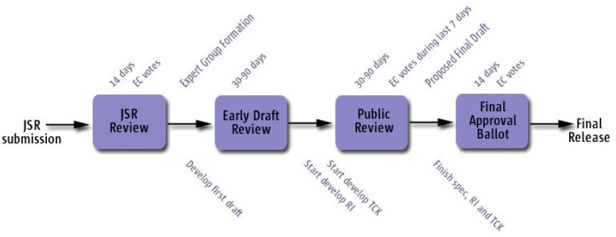

<table width="100%" border="0" cellspacing="0" cellpadding="0">
<tr>
<th><h2>Welcome to the JSR 358 (JCP.next.3) project</h2></th>
<th> </th>
</tr>
</table>

This is the public project for [JSR 358: A major revision of the Java Community Process](http://jcp.org/en/jsr/detail?id=358), 
the third of several ''JCP.next'' JSRs to modify the JCP's processes. 

This JSR will make changes to the JSPA, the Process Document, and the Executive Committee's Standing Rules with the goals of further improving the organization's processes, correcting problems that have become apparent over recent years, and clarifying language to reduce ambiguity.

As required by JCP 2.8 (introduced with JSR 348) we will discuss our business in public, publish all of our working materials and meeting minutes, and track issues in the open:

*  Subscribe to the <a href="http://java.net/projects/jsr358/lists">Observers' mailing-list</a> (you'll need a java.net login) to review and respond to Expert Group communications.

* Visit the <a href="http://java.net/projects/jsr358/forums/General">discussion forum</a> to comment on the work of the Expert Group (we'd prefer that you use this rather than the Observer alias, to keep mail traffic down.)

* For our meeting minutes and working documents, visit the <a href="https://github.com/jcp-org/jsr358/wiki/DocumentIndex">document archive</a>.

* We use the <a href="https://github.com/jcp-org/jsr358/issues">issue tracker</a> to record your comments and track issues. To be informed when new issues are logged and comments are added to existing issues you can <a href = "https://java.net/jira/secure/ViewSubscriptions.jspa?filterId=11399">subscribe directly to the JIRA</a> or alternatively subscribe to the <a href="http://java.net/projects/jsr358/lists"> Issues mailing list</a>.

NOTE: there is no need to formally "join" this project in order to participate - everything is visible to those who are not project members, and formal ''observer'' status carries no additional privileges.

 
